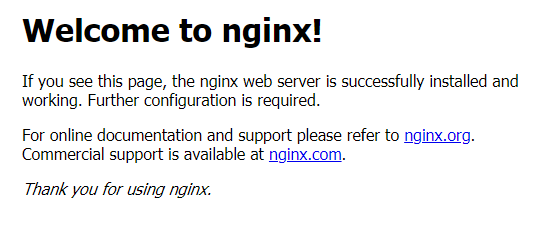

# Azure Infrastructure Operations: Deploying a scalable IaaS web server in Azure

## Introduction
This project deploys a scalable web server on the Azure cloud platfrom using Terraform and Packer.

The infrastructure can be configured via the **vars.tf file**, which can be modified using the editor of your choice (instructions will use **vi**).

**Note:**
The vi text editor has 2 modes (_command_ & _insert_). When vi is initially opened, it opens in _command mode_. In order to change a file, you must be in _insert mode_.
To enter _insert mode_, simply press the `i` key and make necessary changes. Once the changes are complete, press `Esc` to return to _command mode_, and finally type `:wq` to save any changes.
An excellent vi introduction from RedHat can be found [here](https://www.redhat.com/sysadmin/introduction-vi-editor).

## Getting Started
1. Clone this repository.
2. Ensure the required dependencies are satisfied.
3. Follow the instructions to perform the web server deployment.

## Dependencies
1. Create an [Azure Account](https://portal.azure.com) 
2. Install the [Azure command line interface (CLI)](https://docs.microsoft.com/en-us/cli/azure/install-azure-cli?view=azure-cli-latest)
3. Install [Packer](https://www.packer.io/downloads)
4. Install [Terraform](https://www.terraform.io/downloads.html)

## Instructions
* Open the Azure CLI and run ```az login``` to login.
* ```cd``` to the root directory of the cloned repository.
* Create a service principal and output the credentials for use in the Packer image:

    ```az ad sp create-for-rbac --query "{ client_id: appId, client_secret: password, tenant_id: tenant }"```
* Query your Azure Subscription ID:

    ```az account show --query "{ subscription_id: id }"```
* Using your preferred text editor, modify the **server.json** file with the output values from the previous two commands.
    * ```$ vi server.json``` and type ```i``` to enter insert mode.  Apply the following changes:
        * **az ad sp: client_id** => **server.json: client_id** 
        * **az ad sp: client_secret** => **sever.json: client_secret**
        * **az ad sp: tenant_id** => **server.json: tenant_id**
        * **az account show: subscription_id** => **server.json: subscription_id**
    * Once complete type ```:wq``` to save the changes.

* Using your preferred text editor, change the values in **vars.tf** specific to your project.
    * ```$ vi server.json``` and type ```i``` to enter insert mode.
        * Apply your configuration changes.
    * Once complete type ```:wq``` to save the changes.

* Decide on a prefix to use for the project (ie. 'udacity-devops').
* Run ```packer build -var 'prefix=udacity-devops' server.json``` to create an image of the VMs used in the scale set.
* Run ```terraform init``` to initailize terraform.
* Run ```terraform plan``` to view a plan of the infrastructure.
* Run ```terraform apply``` to build the infrastucture.

## Output
Terraform will output connection information for the web server.
* **vmss_public_ip**: Browsing to the output address you should see:

